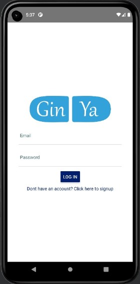
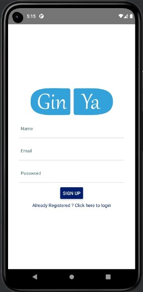
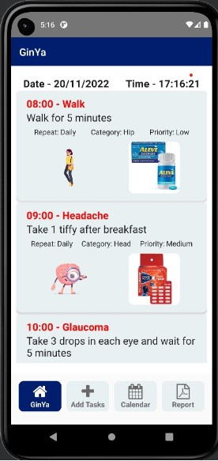
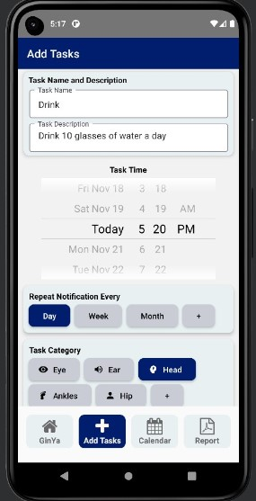
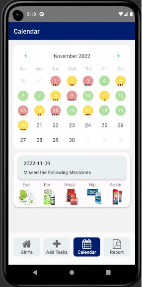
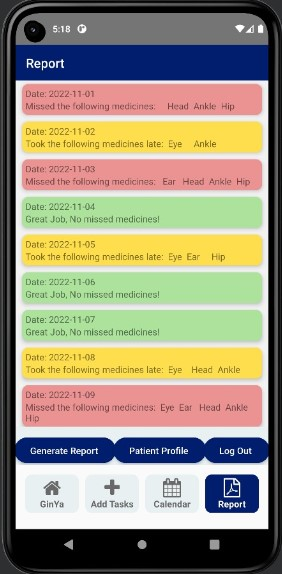

# GinYa Application

Application that would track and notify patients to take the correct medication at the prescribed amount and designated time. The patient’s intake of medication would be recorded and a report would be generated. This report would then aid doctors to accurately diagnose the patient and their recovery before providing the patient with a new medical prescription.

## Installation

To run the application, we used android studio because of the various features it provided that helped develop the application. All one needs to do to setup the project on their own device is:

1. ```bash git clone``` the Github repository onto their Android Studio

2. ```bash git clone https://github.com/6222790345/GinYa.git```

3. Install all the dependencies listed in Package.json using ```bash npm i```

4. Setup a virtual android device (Pixel 5 and Android 11 worked best for us)

5. Run  the following code in cmd to start the application ```bash npx react-native run-android```

6. Wait for node.js to bundle the entire application and start it on the virtual device

7. Login/Signup to GinYa

## Application Sample

> More sample of the application can be found in [This Link](./ApplicationSample).

### Login

<p align="left"> 
    <p>- Users can login to their existing accounts or click on the signup button to go to the signup page </br>
    <p>- Application loads the authenticate page first </br>
    
</p>


### Sign Up

<p align="left">
 <p>- Users can register for a new account or click on the login button to go to the login page </br>
 <p>- Once the user signs up for a new account they are automatically redirected to the login page</br>
  
</p>


### View Tasks
<p align="left">
 <p>- The View Tasks page lists all the tasks the user needs to complete from the tasksList atom </br>
 <p>- The page auto sorts all the tasks according to their time and stylizes them accordingly </br>
 <p>- The user can delete the tasks, undo accidently deleted tasks and scroll throuhg the various tasks </br>
  
</p>

### Add Task
<p align="left">
<p>- Users should be able to add more tasks from this page </br>
<p>- Clicking on set notification updates the tasksList atom and also sets up a notification </br>
  
</p>

### Calendar View
<p align="left">
<p>- This page summarises the staus of tasks on each of the day of the month from the tasksStatus atom</br>
<p>- Users can click on individual dates to see the task status for that day </br>
  
</p>

### Report Page
<p align="left">
<p>- Users should be able to generate a pdf report for their doctors </br>
<p>- They can do this using the generate report button which makes a report out of tasksStaus atom </br>
<p>- The Patient Profile button converts a google document to a pdf and allows that to be shown as a pdf in the app </br>
<p>- The log out button allows user to change the authenticateState to false again thus going back to the Authenticate page </br>
  
</p>


## Languages and Tools
<p align="left"> <a href="https://developer.android.com" target="_blank" rel="noreferrer">  </a> <a href="https://www.w3schools.com/css/" target="_blank" rel="noreferrer">  </a> <a href="https://www.figma.com/" target="_blank" rel="noreferrer">  </a> <a href="https://firebase.google.com/" target="_blank" rel="noreferrer">  </a> <a href="https://git-scm.com/" target="_blank" rel="noreferrer">  </a> <a href="https://www.w3.org/html/" target="_blank" rel="noreferrer">  </a> <a href="https://developer.mozilla.org/en-US/docs/Web/JavaScript" target="_blank" rel="noreferrer">  </a> <a href="https://reactnative.dev/" target="_blank" rel="noreferrer">  </a> </p>

